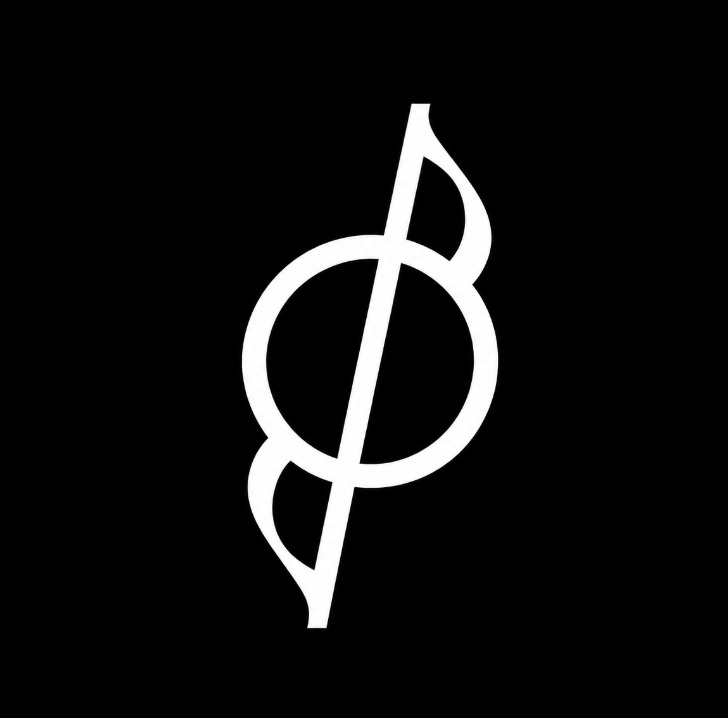

<p align="center">
  
</p>

<p align="center">
  <a href="#watch-orchestra"><strong>Watch Orchestra</strong></a> &nbsp; · &nbsp;
  <a href="#start-with-one-project"><strong>Get started</strong></a> &nbsp; · &nbsp;
  <a href="#build-from-source">Build from source</a> &nbsp; · &nbsp;
  <a href="#privacy">Privacy</a>
</p>

Your PRD says one thing. A conversation changes the scope. Your coding agent still has yesterday's context.

**Orchestra is a Product Brain for High Speed Teams.** It connects source material, reviewed decisions and implementation evidence, so people and agents can work from the same accepted product context.

*Private beta for Apple Silicon Macs. Repository access is required; there are no public downloads.*

## Watch Orchestra

### Product overview

The context problem, the product, and the value of making decisions explicit.

https://github.com/user-attachments/assets/9dd87791-42be-4801-8bad-c71fe8ddcd7e

### Open the evidence behind an answer

A closer look at the source-to-answer workflow in the actual desktop app.

https://github.com/user-attachments/assets/9adb1381-e826-4760-a853-e979ece3fd7b

*These existing previews show evidence-only mode, not AI synthesis. They use a fictional project and edited captures, not a latency benchmark. The replacement narrated launch film and real-AI walkthrough are still being recorded and reviewed.*

## Ask a product question. Check the source.

“What is in scope for launch, and what is still only a request?”

**Socrates** answers from project evidence with citations you can open. **Memory** keeps the underlying documents available for inspection. **Deep Research** turns a larger question into a source-linked report you can save alongside the project.

Accepted decisions and ordinary source material remain distinct. A document saying “approved” is not itself a recorded approval, and a saved AI report remains generated evidence.

<p align="center">
  
</p>

## Review a change before it becomes the plan

“Can we add PDF export?” should start a decision, not silently rewrite the requirements.

**Truth Inbox** brings proposed changes and review findings into one place. **Change Packets** connect a proposal to its evidence and affected areas, giving authorised reviewers the context to decide.

The decision chain is explicit:

**Source evidence → proposed change → authorised review → accepted Product Brain → implementation evidence**

**Product Brain** and **Live Doc** make accepted context available to the team. **Timeline** preserves the history behind it. You can inspect what was agreed, what prompted the change and what still needs a decision.

## Give your agent the context you actually agreed on

**Agent Preflight** assembles a task-specific pack: scoped evidence, accepted product context, implementation boundaries, an acceptance checklist and open questions. Unresolved questions and blockers remain visible.

1. Describe the work and inspect the Preflight pack.
2. Pair your client and retrieve that **exact pack ID** through Orchestra MCP.
3. Link the agent's implementation evidence to the same pack for **Postflight** review.

The pack connects intent to reported work. Postflight evidence does not automatically approve new requirements or certify a release. The currently qualified desktop clients are **Codex and VS Code**.

## Bring the context you choose

Start with selected files, folders or local Git repositories. Connect authorised **GitHub**, **Google Drive** and **Slack** sources when you need engineering, document or conversation evidence alongside the product requirements.

Source selection is explicit. Orchestra does not automatically index your home directory, and connecting a shared workspace does not publish your local projects.

## Start with one project

After building or receiving an authorised internal package:

1. Choose **Local** and create a project. No hosted signup is needed.
2. Add a source document, wait for processing, then open it in Memory.
3. For AI generation, open **Settings → Desktop AI**: select a provider, add your API key, choose a model, **Test connection**, then **Save and restart**.
4. Ask Socrates a specific question and open a citation to check the answer.

Without an AI key, saved-document reading and evidence search remain available. External AI use requires network access and provider credit; no AI credits are included. Start with [the setup and compatibility guide](docs/desktop/release/USER-GUIDE.md#add-an-api-key).

## One Mac or a shared team workspace

| | Local workspace | Shared workspace |
| --- | --- | --- |
| Project data | Application-managed database and files on your Mac | Your selected server |
| Identity and decisions | Installation-local owner | Server-owned identity, membership and authorisation |
| Offline access | Read and search saved evidence | Optional expiring, read-only metadata cache; off by default |
| Changes | Stay local unless explicitly transferred | Require live server authorisation |

Orchestra manages its own **PostgreSQL/pgvector** runtime locally. The packaged app does not require Docker or a separately installed database. Team operators can use the versioned [self-hosting guide](infra/self-host/v1/README.md) with a compatible trusted HTTPS server.

## Privacy

- **Your sources, your selection.** Import only the files, repositories and provider resources you intend to use.
- **Your AI configuration.** Relevant request context goes to the provider you choose. Local keys do not configure or get uploaded to a shared server.
- **Protected credentials.** Secrets use OS-protected storage outside the web renderer. Documents and the database rely on your Mac account and disk encryption; full application-level encryption is not claimed.
- **Visible network boundaries.** AI and connectors contact their providers; shared mode contacts its server. The current UI also references Google Fonts, so local mode does not mean zero network traffic.

Read the [usage, privacy and recovery guide](docs/desktop/release/USER-GUIDE.md) for retention, export and backup boundaries.

## Build from source

For contributors with repository access: **macOS Apple Silicon, Node.js 24/npm, Xcode command-line tools, Perl/tar and network access**. Use a fresh checkout without production credentials or customer data.

```sh
git clone https://github.com/KarthikRamesh9149/Orchestra.git
cd Orchestra
npm ci --ignore-scripts
npm --prefix apps/desktop ci
npm run prisma:generate
npm run build
npm --prefix apps/desktop run typecheck
npm --prefix apps/desktop run build
mkdir -p .desktop
export DEVELOPER_DIR=/Library/Developer/CommandLineTools
export SDKROOT="$(xcrun --sdk macosx --show-sdk-path)"
node scripts/desktop/build-native-mac.mjs
node scripts/desktop/prepare-native.mjs
npm --prefix apps/desktop run package
```

Install desktop dependencies before the root build. The internal package path is written to `.desktop/latest-package.txt`. See [BUILD.md](docs/desktop/release/BUILD.md) for native provenance and applicable checks; do not bypass macOS security warnings.

<details>
<summary><strong>Current qualification and release boundaries</strong></summary>

- **Platform:** Apple Silicon Mac internal beta, unsigned and manual-update-only. Windows, signing/notarisation, automatic updates and two-physical-computer qualification are deferred.
- **AI:** OpenAI has real-account Socrates, Deep Research, streaming and restart evidence on the tested Mac configuration. Anthropic, Gemini and compatible API adapters remain previews pending real-account workflow qualification; models must meet the required protocols.
- **Connectors:** Internal real-account checks cover the desktop connector scope. New-account and new-workspace onboarding still needs qualification; a provider app registration does not establish customer onboarding readiness.
- **Notices:** The latest internal artifact check found no missing notices or listed unresolved bundled packages. Historical artifacts are not retroactively cleared. Final source/history and publication review remains separate.
- **Distribution:** The repository remains private by explicit owner instruction. Local tests and internal packages do not constitute public-release certification.

[Release status](docs/desktop/release/README.md) · [Desktop contract](docs/desktop/CONTRACT.md) · [Provider guide](docs/desktop/release/USER-GUIDE.md#add-an-api-key) · [Notice review](docs/desktop/THIRD-PARTY-REVIEW.md)

</details>

## Project documentation

[Architecture](docs/desktop/ADR-001.md) · [Feature inventory](docs/desktop/feature-parity.json) · [Threat model](docs/desktop/THREAT-MODEL.md) · [Manual updates and recovery](docs/desktop/INTERNAL-UPDATE-RECOVERY.md) · [Contributing](CONTRIBUTING.md)

Maintainer and recovery owner: **Karthik Ramesh**. Private support: **hello@orchestraos.dev**. Include the app version and reproduction steps, not credentials or customer records.

First-party code is licensed under [Apache-2.0](LICENSE). Third-party components retain their own licences and notices. The licence does not authorise publication of this private repository.

<p align="center">
  
</p>
