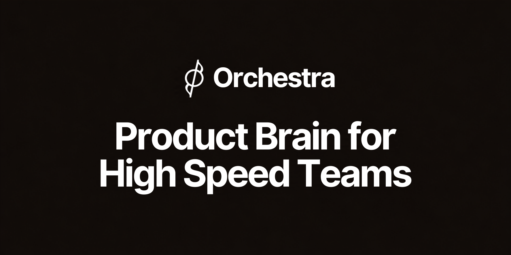
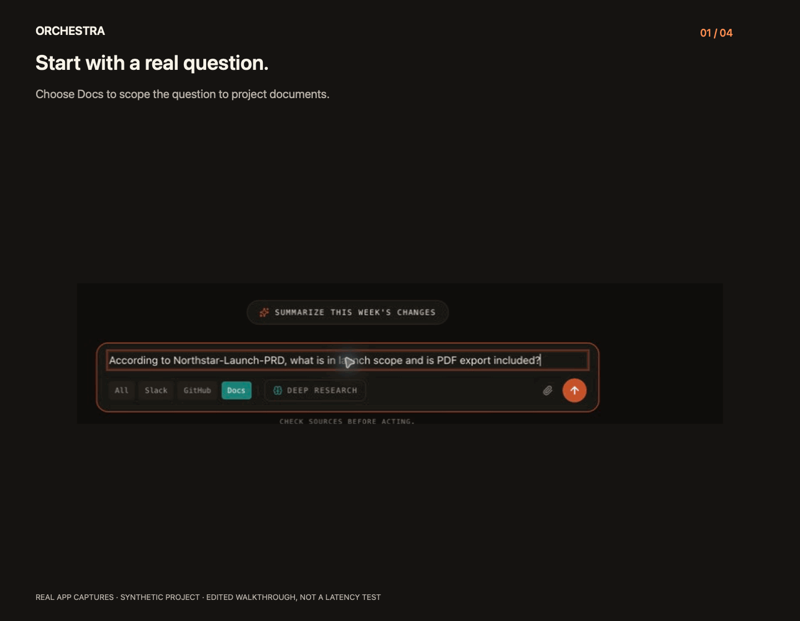
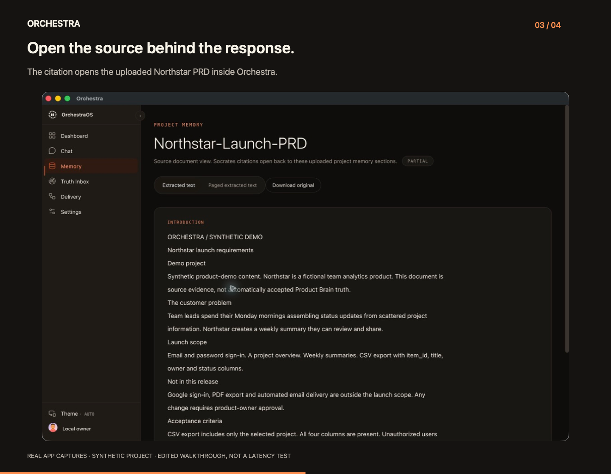
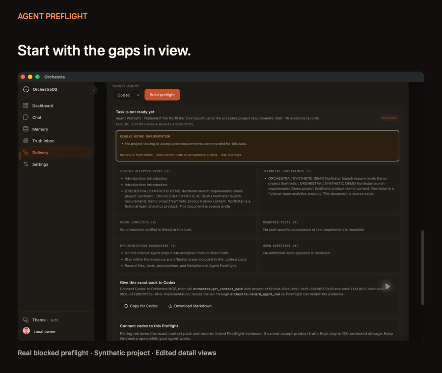

<p align="center">
  
</p>

<p align="center">
  <a href="#watch-the-product"><strong>Watch the product</strong></a> &nbsp; · &nbsp;
  <a href="docs/desktop/release/BUILD.md"><strong>Build locally</strong></a> &nbsp; · &nbsp;
  <a href="infra/self-host/v1/README.md"><strong>Self-host</strong></a> &nbsp; · &nbsp;
  <a href="#privacy">Privacy</a>
</p>

Your PRD says one thing. A conversation changes the scope. Your coding agent still has yesterday's context.

**Orchestra brings project evidence, decisions and agent context together, so your team knows what it is building and why.**

> Private Mac beta. Source access is required. Public downloads are not available yet.

## Watch the product

From scattered requirements to inspectable evidence and clearer agent context, in one minute.

https://github.com/user-attachments/assets/9dd87791-42be-4801-8bad-c71fe8ddcd7e

*60-second original film: illustrative framing and real captures of a fictional project. The demo shows evidence-only mode, not AI synthesis, and retains preflight blockers. [Film details](docs/desktop/media/PRODUCT-FILM.md) · [Focused 24-second walkthrough](https://github.com/user-attachments/assets/9adb1381-e826-4760-a853-e979ece3fd7b)*

## Keep the source one click away

A useful answer should take you back to the evidence. Socrates keeps source links beside the response; Memory opens the uploaded document so you can check the requirement yourself.

<p align="center">
  <a href="docs/desktop/media/orchestra-evidence-walkthrough.gif">
    
  </a>
</p>

With your AI provider configured, Socrates can synthesize answers from project context. Without it, reading and evidence search remain available, without pretending an AI answer was generated.

In local Settings, **Select provider → Add API key → Test connection → Save**.
Adapters support OpenAI, Anthropic, Google Gemini and compatible Chat Completions
APIs. Models must support Orchestra's required response formats; an API key alone
does not establish compatibility. OpenAI has real-account workflow verification;
the other adapters remain preview integrations pending real-account tests.
[Setup and compatibility details](docs/desktop/release/USER-GUIDE.md#add-an-api-key).

## Turn a request into a deliberate decision

“Can we add this before launch?” is new evidence, not automatic approval.

**Truth Inbox** brings proposed changes and review findings together. **Change Packets** show the evidence and affected areas. Authorized review determines what becomes accepted project truth.

The workflow stays explicit:

**Source evidence → proposed change → human review → accepted truth → implementation evidence**

Product Brain and Live Doc keep the approved context available to the team. Timeline helps explain when and why it changed. Delivery views expose implementation evidence and unresolved gaps; they do not certify that a release is safe.

<p align="center">
  
</p>

*Start with the source. Reading or generating context is not the same as approving a change.*

## Give your coding agent the right starting point

Before Codex starts, **Agent Preflight** assembles scoped context, constraints, required tests and unresolved questions. A missing decision stays visible instead of becoming the agent's assumption.

<p align="center">
  <a href="docs/desktop/media/orchestra-preflight-walkthrough.gif">
    
  </a>
</p>

*Edited detail views of a real blocked preflight. The demo does not claim that an agent completed the task.*

1. Describe the implementation task.
2. Review the context pack and any blockers.
3. Let your paired agent retrieve that **exact pack ID** through Orchestra MCP.
4. Record its work against that pack for **Postflight** review.

Postflight records implementation evidence. It does not silently approve new product requirements. The currently qualified desktop-client scope is **Codex and VS Code**.

## Questions worth asking your Product Brain

| You need to know | Orchestra helps you inspect |
| --- | --- |
| What did we agree to build? | Accepted requirements and their supporting sources. |
| Did this message change the scope? | The proposed change, evidence and review state. |
| Why does the PRD differ from the implementation? | Linked product and engineering evidence, with remaining gaps. |
| What should I give my coding agent? | Task-specific context, boundaries and unresolved decisions. |
| Was the approved change delivered? | Recorded implementation and delivery evidence. |
| What needs attention this week? | Pending reviews, context health and source-linked briefs. |

## Bring the context you choose

| Source | Selection |
| --- | --- |
| Files and folders | Explicitly selected local evidence. |
| Git repositories | Selected local repositories and engineering context. |
| GitHub | Authorized repositories and their supported evidence. |
| Google Drive | Selected documents with provider authorization. |
| Slack | Selected authorized conversation sources. |
| Agent clients | Scoped MCP access for Codex and VS Code. |

Internal real-account checks cover the desktop connector scope. New-user and new-workspace onboarding is still being qualified; an installable provider app is not proof that every customer's connection works.

## Local when you want it. Shared when you need it.

| | Local workspace | Shared workspace |
| --- | --- | --- |
| Authority | This installation | Your selected server |
| Data | Application-managed database and files on your Mac | Server-owned project data and permissions |
| Sign-in | No hosted signup required | Server identity and membership |
| Offline | Read and search saved evidence | Optional bounded, read-only cache; disabled by default |
| Team changes | Not silently published | Live server authorization required |

The desktop app manages its own PostgreSQL/pgvector runtime. Consumer local operation does not require Docker or a separately installed database. Operators can use the versioned [self-hosting package](infra/self-host/v1/README.md) for shared teams.

## Privacy

- **Choose what enters the workspace.** Local data is not silently published to a shared server.
- **Bring your own AI configuration.** Relevant request context goes to your selected external provider. Its API charges may apply; no credits are included.
- **Keep credentials outside the renderer.** Secrets use OS-protected storage rather than browser persistence.
- **Protect the Mac itself.** Source files and the database rely on your account and disk encryption; application-level encryption of every file is not promised.
- **Know what leaves the device.** Connectors contact their providers, shared mode contacts its server, and the current UI references Google Fonts. Local mode is not a claim of zero network traffic.

[Full network, retention and recovery guide →](docs/desktop/release/USER-GUIDE.md)

## System requirements

| | Current internal scope |
| --- | --- |
| Platform | macOS on Apple Silicon |
| Local runtime | Application-managed PostgreSQL/pgvector and files |
| AI generation | A configured external AI provider; network and provider credit required |
| Without AI | Saved-document reading and evidence search |
| Shared teams | A compatible trusted HTTPS server |
| Updates | Manual upgrade and recovery; no automatic updater |
| Source build | Node.js 24/npm, Xcode command-line tools, Perl/tar and network access |

Windows, public signed/notarized distribution and two-computer qualification are deferred. No universal CPU, memory or latency benchmark is claimed.

## Build from source

For maintainers and contributors with repository access, start from a fresh checkout without production secrets or customer data:

```sh
git clone https://github.com/KarthikRamesh9149/Orchestra.git
cd Orchestra
npm ci --ignore-scripts
npm run prisma:generate
npm run build
npm --prefix apps/desktop ci
npm --prefix apps/desktop run typecheck
npm --prefix apps/desktop run build
mkdir -p .desktop
node scripts/desktop/build-native-mac.mjs
node scripts/desktop/prepare-native.mjs
npm --prefix apps/desktop run package
```

The [full build guide](docs/desktop/release/BUILD.md) covers prerequisites, native provenance and applicable tests. The internal package path is recorded in `.desktop/latest-package.txt`. Do not bypass macOS security warnings to distribute an unsigned build.

## Contributing and support

Read [CONTRIBUTING.md](CONTRIBUTING.md) for setup, change boundaries, verification and safe demo data.

Maintainer and recovery owner: **Karthik Ramesh**. Private support: **hello@orchestraos.dev**. Include the app version and reproduction steps, not credentials or customer records.

<details>
<summary><strong>Architecture, qualification and release evidence</strong></summary>

- [Desktop contract](docs/desktop/CONTRACT.md), [architecture](docs/desktop/ADR-001.md) and [threat model](docs/desktop/THREAT-MODEL.md).
- [Feature inventory](docs/desktop/feature-parity.json) and [release status](docs/desktop/release/README.md).
- [Local workflow evidence](docs/desktop/STEP-4-ACCEPTANCE.md) and [manual update/recovery](docs/desktop/INTERNAL-UPDATE-RECOVERY.md).
- [Immutable source import](docs/desktop/import-manifest.json) and [hosted-only test exclusions](docs/desktop/upstream-checks.json).
- [Third-party notice review](docs/desktop/THIRD-PARTY-REVIEW.md): seven attribution blockers remain.

Passing local tests is not public-release certification. No paid GitHub Actions or production deployment is enabled by this desktop work. The managed `orchestrav2` product remains separate.

</details>

## License

First-party code is [Apache-2.0](LICENSE), approved by the owner after confirming ownership of the original code/assets. Third-party components retain their own licenses and notices.

This repository remains **private by explicit owner instruction**. Licensing the first-party code does not authorize publication or clear unresolved third-party obligations.
